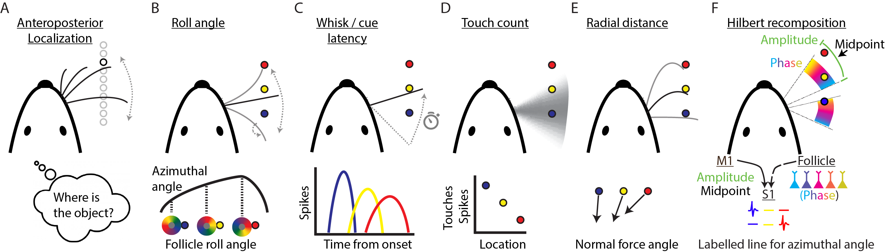

# The sensorimotor basis of whisker-guided anteroposterior object localization in head-fixed mice

## Summary: 
Locating objects through the sense of touch is an essential behavior across animal species. In humans and mice, tactile object localization is an active process that combines directed sensor motion with mechanosensory signals. How these motion and sensory signals are combined in the brain to produce tactile perception remains poorly understood. Identifying the motor strategies deployed and the resulting sensorimotor signal features that underlie location perception during these behaviors is an essential step to understanding the algorithms and neural circuit implementations of active sensory perception 

Head-fixed rodents are a powerful model to study tactile perception due to the fine level of experimental control. Rodents can perform object location, shape, and texture discrimination using only their whiskers. As they are actively performing, high speed videography and models of whisker physics can be used to extract whisker kinematics. Further, electrophysiology or calcium imaging can be used to observe the brain during behavior. 

In the context of precise object localization, 6 plausible models have been hypothesized over the past decade (see below). We seek in this project to discern the simplest model to provide a foundation for the computation of object location representation in the cortex. 

## Requirements
All code was written and tested on MATLAB 2018b. Specific toolboxes from Mathworks may be required. 

## Data Availability:
Data structures for Cheung et al. 2019 hosted on Hires Lab Dropbox at (https://www.dropbox.com/sh/bjla01r0bzt49j7/AAAzMjaq2mZSH5Gp8sf_UY5ga?dl=0).

